# Branches & Jumps

Control flow instructions that modify the program counter.

## J — Unconditional Jump

**Opcode:** `1111`

<div class="bit-field">
  <div class="field field-opcode" style="flex:4"><div class="bits">15:12</div><div class="value">1111</div></div>
  <div class="field field-offset" style="flex:12"><div class="bits">11:0</div><div class="value">Offset (12-bit signed)</div></div>
</div>

PC-relative unconditional jump.

```asm
J %label%           ; PC = current_addr + 1 + offset
```

- **Resolves in:** <span class="stage-badge stage-id">ID</span>
- **Flush slots:** 1 (instruction in IF is flushed)
- **Offset calculation:** `target_addr - current_addr - 1`
- **Range:** -2048 to +2047 instructions

## JAL — Jump and Link

**Opcode:** `1101`

<div class="bit-field">
  <div class="field field-opcode" style="flex:4"><div class="bits">15:12</div><div class="value">1101</div></div>
  <div class="field field-offset" style="flex:12"><div class="bits">11:0</div><div class="value">Offset (12-bit signed)</div></div>
</div>

Jump and save return address in `$15`.

```asm
JAL %function%      ; $15 = PC + 2; PC = target
```

- **Return address:** PC + 2 (MIPS convention — skips the flush slot)
- **Resolves in:** <span class="stage-badge stage-id">ID</span>
- **Flush slots:** 1

!!! note "JAL writes $15 via hardcoded path"
    JAL's bits 11:8 contain offset bits, not a register index. The write to `$15` is handled by a dedicated path in the register bank that bypasses the normal R0 protection guard.

## JR — Jump Register

**Opcode:** `1100`

<div class="bit-field">
  <div class="field field-opcode" style="flex:4"><div class="bits">15:12</div><div class="value">1100</div></div>
  <div class="field field-reg" style="flex:4"><div class="bits">11:8</div><div class="value">Rs</div></div>
  <div class="field field-unused" style="flex:4"><div class="bits">7:4</div><div class="value">0000</div></div>
  <div class="field field-unused" style="flex:4"><div class="bits">3:0</div><div class="value">0000</div></div>
</div>

Jump to address in register Rs.

```asm
JR $15              ; PC = $15 (return from JAL)
```

- **Resolves in:** <span class="stage-badge stage-id">ID</span> (reads register at decode time)
- **Flush slots:** 1

!!! warning "JR stall"
    Since JR reads a register at the ID stage (before forwarding), it stalls if the source register is being written by an instruction in ALU or MEM. WB-stage writes are covered by the register bank's write-through bypass.

## BZ — Branch on Zero

**Opcodes:** `1000` (BZ X), `1001` (BZ T), `1010` (BZ N)

<div class="bit-field">
  <div class="field field-opcode" style="flex:4"><div class="bits">15:12</div><div class="value">10xx</div></div>
  <div class="field field-offset" style="flex:12"><div class="bits">11:0</div><div class="value">Offset (12-bit signed)</div></div>
</div>

| Variant | Opcode | Condition |
|---------|--------|-----------|
| `BZ X` | `1000` | Always branch (unconditional) |
| `BZ T` | `1001` | Branch if Z = 1 (result was zero) |
| `BZ N` | `1010` | Branch if Z = 0 (result was non-zero) |

```asm
SUB $1, $2
BZ %equal%, T       ; branch if $1 == $2 (SUB result was zero)
```

- **Resolves in:** <span class="stage-badge stage-alu">ALU</span>
- **Flush slots:** 2 (IF and ID are flushed)
- **Offset calculation:** `target_addr - current_addr - 2`
- **Z flag source:** Set only by R-type and S-type instructions

!!! info "Z flag gating"
    The Z flag is only updated by R-type (`alu_ctl="001"`) and S-type (`alu_ctl="010"`) instructions. NOPs, loads, stores, and other operations do not affect Z, preventing false branches.

## BHLEQ — Branch if Higher/Lower/Equal

**Opcode:** `0110`

<div class="bit-field">
  <div class="field field-opcode" style="flex:4"><div class="bits">15:12</div><div class="value">0110</div></div>
  <div class="field field-offset" style="flex:12"><div class="bits">11:0</div><div class="value">Offset (12-bit signed)</div></div>
</div>

Complementary branch to BZ, used for signed comparison chains.

```asm
BHLEQ %target%      ; branch based on comparison result
```

- **Resolves in:** <span class="stage-badge stage-alu">ALU</span>
- **Flush slots:** 2
- **Offset calculation:** `target_addr - current_addr - 2`

## Flush Slot Convention

All branches and jumps have a flush slot — the instruction immediately after the branch is **not executed** (it is flushed from the pipeline).

=== "J / JAL / JR (1 slot)"

    ```asm
    J %target%
    NOP                 ; flushed — never executes
    ; execution continues at target
    ```

=== "BZ / BHLEQ (2 slots)"

    ```asm
    BZ %target%, T
    NOP                 ; flushed
    NOP                 ; flushed
    ; execution continues at target (if taken)
    ```

!!! tip "The assembler handles flush offsets"
    When using `%label%` syntax, the assembler automatically accounts for flush slots in the offset calculation. You don't need to adjust offsets manually.

## Pipeline Timing

### J / JAL (ID-stage resolution)

```mermaid
gantt
    title J/JAL Pipeline Timing
    dateFormat X
    axisFormat %s
    section J target
        IF  : 0, 1
        ID (resolve) : 1, 2
    section next_inst
        IF (flushed) : 1, 2
    section target[0]
        IF  : 2, 3
        ID  : 3, 4
```



### BZ / BHLEQ (ALU-stage resolution)

```mermaid
gantt
    title BZ Pipeline Timing (taken)
    dateFormat X
    axisFormat %s
    section BZ target
        IF  : 0, 1
        ID  : 1, 2
        ALU (resolve) : 2, 3
    section inst+1
        IF (flushed) : 1, 2
    section inst+2
        IF (flushed) : 2, 3
    section target[0]
        IF  : 3, 4
        ID  : 4, 5
```


