# Immediates & Loads

Instructions that load constant values into registers or add an immediate.

## LIU — Load Immediate Upper

**Opcode:** `0100`

<div class="bit-field">
  <div class="field field-opcode" style="flex:4"><div class="bits">15:12</div><div class="value">0100</div></div>
  <div class="field field-reg" style="flex:4"><div class="bits">11:8</div><div class="value">Rd</div></div>
  <div class="field field-imm" style="flex:8"><div class="bits">7:0</div><div class="value">Immediate</div></div>
</div>

Writes the 8-bit immediate to the **upper byte** of Rd. Lower byte is unchanged.

```asm
LIU $1, 0x5A       ; $1[15:8] = 0x5A, $1[7:0] unchanged
```

## LIL — Load Immediate Lower

**Opcode:** `0101`

<div class="bit-field">
  <div class="field field-opcode" style="flex:4"><div class="bits">15:12</div><div class="value">0101</div></div>
  <div class="field field-reg" style="flex:4"><div class="bits">11:8</div><div class="value">Rd</div></div>
  <div class="field field-imm" style="flex:8"><div class="bits">7:0</div><div class="value">Immediate</div></div>
</div>

Writes the 8-bit immediate to the **lower byte** of Rd. Upper byte is unchanged.

```asm
LIL $1, 0x34       ; $1[7:0] = 0x34, $1[15:8] unchanged
```

## LIW — Load Immediate Word (Pseudo-Instruction)

`LIW` is an assembler pseudo-instruction that expands to two real instructions.

```asm
LIW $1, 0x5A34
```

Expands to:

```asm
LIU $1, 0x5A       ; upper byte first
LIL $1, 0x34       ; lower byte second
```

!!! warning "LIU must come before LIL"
    The assembler always generates LIU first, then LIL. LIL preserves the upper byte written by LIU. Reversing the order would clobber the upper byte.

!!! note "NFW stall"
    LIU and LIL use non-forwarding partial writes (`regbnk_ctl` = `"010"` / `"011"`). A dependent instruction following LIW will be stalled automatically for 3 cycles by the NFW hazard detection. No manual NOPs needed.

## ADDI — Add Immediate

**Opcode:** `1011`

<div class="bit-field">
  <div class="field field-opcode" style="flex:4"><div class="bits">15:12</div><div class="value">1011</div></div>
  <div class="field field-reg" style="flex:4"><div class="bits">11:8</div><div class="value">Rd</div></div>
  <div class="field field-imm" style="flex:8"><div class="bits">7:0</div><div class="value">Immediate</div></div>
</div>

Adds an 8-bit **sign-extended** immediate to Rd.

```asm
ADDI $1, 5          ; $1 = $1 + 5
ADDI $2, -1         ; $2 = $2 - 1  (immediate = 0xFF)
```

- **Range:** -128 to +127 (sign-extended from 8 to 16 bits)
- **Z flag:** Updated if result is zero
- **Forwarding:** Full ALU forwarding — no stalls for back-to-back use

### How it Works

The `alu_imm_sel` signal overrides the ALU's B input with the sign-extended immediate instead of reading from a register. The ALU performs a standard ADD.

## Pipeline Behavior

### LIU / LIL

- **Write stage:** <span class="stage-badge stage-wb">WB</span> (partial byte write)
- **Hazard type:** NFW stall (non-forwarding write)
- **Stall cycles:** Up to 3 (combinational, auto-sustaining)

### ADDI

- **Resolves in:** <span class="stage-badge stage-alu">ALU</span>
- **Forwarding:** Full ALU→ALU and MEM→ALU — same as R-type
- **Stall cycles:** 0 for back-to-back ADDI

```mermaid
gantt
    title LIW + Dependent (NFW Stall)
    dateFormat X
    axisFormat %s
    section LIU $1, hi
        IF  : 0, 1
        ID  : 1, 2
        ALU : 2, 3
        MEM : 3, 4
        WB  : 4, 5
    section LIL $1, lo
        IF  : 1, 2
        ID  : 2, 3
        ALU : 3, 4
        MEM : 4, 5
        WB  : 5, 6
    section ADD $2, $1
        IF  : 2, 3
        ID (stall) : 3, 6
        ALU : 6, 7
        MEM : 7, 8
        WB  : 8, 9
```


