# Interrupts & Exceptions

Software traps (SYSCALL) and external interrupt handling.

**Opcode:** `1110` (M1), with M1Func `1011` (SYSCALL) or `1100` (M4 group)

## Exception Registers

| Register | Width | Reset | Purpose |
|----------|-------|-------|---------|
| **EPC** | 16-bit | 0x0000 | Return address saved on exception entry |
| **ECA** | 16-bit | 0x0000 | Exception cause identifier |
| **IEN** | 1-bit | 0 | Interrupt enable gate |

### ECA Encoding

<div class="bit-field">
  <div class="field field-unused" style="flex:7"><div class="bits">15:9</div><div class="value">0000000</div></div>
  <div class="field field-func" style="flex:1"><div class="bits">8</div><div class="value">Src</div></div>
  <div class="field field-imm" style="flex:8"><div class="bits">7:0</div><div class="value">Service / 0xFF</div></div>
</div>

| Bit 8 | Bits 7:0 | Source |
|-------|----------|--------|
| `1` | Service number | SYSCALL (software trap) |
| `0` | `0xFF` | External interrupt |

---

## SYSCALL — Software Trap

<div class="bit-field">
  <div class="field field-opcode" style="flex:4"><div class="bits">15:12</div><div class="value">1110</div></div>
  <div class="field field-func" style="flex:4"><div class="bits">11:8</div><div class="value">1011</div></div>
  <div class="field field-imm" style="flex:8"><div class="bits">7:0</div><div class="value">Service Number</div></div>
</div>

Triggers exception entry with an 8-bit service number (0–255).

```asm
SYSCALL 42           ; ECA = 0x012A, EPC = addr+2, IEN = 0, PC = 0x0002
NOP                  ; flush slot (not executed)
; handler runs, then RETI returns here
```

**Entry sequence:**

1. `EPC = SYSCALL_addr + 2` (skips flush slot)
2. `ECA = {7'b0, 1'b1, service_number}`
3. `IEN = 0` (disable further interrupts)
4. `PC = 0x0002` (exception vector)
5. Instruction in IF is flushed

- **Resolves in:** <span class="stage-badge stage-id">ID</span> (same as J/JAL)
- **Flush slots:** 1

---

## M4 Group — Exception Control

<div class="bit-field">
  <div class="field field-opcode" style="flex:4"><div class="bits">15:12</div><div class="value">1110</div></div>
  <div class="field field-func" style="flex:4"><div class="bits">11:8</div><div class="value">1100</div></div>
  <div class="field field-func" style="flex:4"><div class="bits">7:4</div><div class="value">SubFunc</div></div>
  <div class="field field-reg" style="flex:4"><div class="bits">3:0</div><div class="value">Rn</div></div>
</div>

| Mnemonic | SubFunc | Syntax | Operation |
|----------|---------|--------|-----------|
| `RETI` | `0000` | `RETI` | `PC = EPC; IEN = 1` |
| `EI` | `0001` | `EI` | `IEN = 1` |
| `DI` | `0010` | `DI` | `IEN = 0` |
| `MFEPC` | `0011` | `MFEPC $rn` | `Rn = EPC` |
| `MFECA` | `0100` | `MFECA $rn` | `Rn = ECA` |
| `MTEPC` | `0101` | `MTEPC $rn` | `EPC = Rn` |

---

### RETI — Return from Exception

```asm
RETI                 ; PC = EPC, IEN = 1
NOP                  ; flush slot
```

- **Resolves in:** <span class="stage-badge stage-id">ID</span> (reuses JR path with `j_dest = EPC`)
- **Flush slots:** 1
- **Side effect:** Re-enables interrupts (`IEN = 1`)

### EI / DI — Enable/Disable Interrupts

```asm
DI                   ; IEN = 0 (mask external interrupts)
; ... critical section ...
EI                   ; IEN = 1 (unmask external interrupts)
```

- **Takes effect at:** <span class="stage-badge stage-id">ID</span>
- **No flush slots**

### MFEPC / MFECA — Read Exception Registers

```asm
MFEPC $5             ; $5 = EPC
MFECA $3             ; $3 = ECA
```

Uses ALU pass-through: `ALU_A = EPC/ECA`, `ALU_B = 0`, result written to Rn via normal `regbnk_ctl = "001"`.

- **Resolves in:** <span class="stage-badge stage-alu">ALU</span>
- **Forwarding:** Full ALU forwarding — dependent instructions get the value without stalls

### MTEPC — Write Exception PC

```asm
LIW $5, 0x1234
MTEPC $5             ; EPC = $5 = 0x1234
```

EPC is written at the <span class="stage-badge stage-wb">WB</span> stage via a pipelined `epcwr` signal.

---

## External Interrupt

When the external `INT` pin is asserted, an interrupt is taken on the next **quiet cycle** — a cycle where no flush or stall is active.

**Condition:**

```
ext_int_take = INT AND IEN AND (NOT flush_active) AND (NOT stalled)
```

**Entry sequence:**

1. `EPC = next_inst_addr` (flushed instruction, re-executed after RETI)
2. `ECA = 0x00FF`
3. `IEN = 0`
4. `PC = 0x0002`
5. In-flight instructions complete normally

- **Priority:** Highest in IF (before J/JAL/JR)
- **Flush slots:** 1 (instruction in IF)

---

## Hazard Handling

### MTEPC → RETI / MFEPC

MTEPC writes EPC at WB. RETI and MFEPC read EPC at ID.

| Distance | Situation | Resolution |
|----------|-----------|------------|
| 1–2 | MTEPC in ALU/MEM | **EPC read stall** (hazard unit) |
| 3 | MTEPC in WB, reader in ID | **EPC write-through bypass** |

### Deny List

SYSCALL and M4 group (except MTEPC) are in the hazard unit's deny list — they don't read GPRs, so no false data-hazard stalls.

---

## Exception Handler Example

```asm
.ADDRESS 0x0002
handler:
    PUSH $1              ; save scratch register
    MFECA $1             ; read exception cause
    ; ... dispatch based on $1 ...
    POP $1               ; restore
    RETI                 ; return, re-enable interrupts
    NOP                  ; flush slot
```

## Pipeline Timing

### SYSCALL Entry

```mermaid
gantt
    title SYSCALL Pipeline Timing
    dateFormat X
    axisFormat %s
    section SYSCALL n
        IF  : 0, 1
        ID (entry) : 1, 2
    section next_inst
        IF (flushed) : 1, 2
    section handler[0]
        IF (0x0002) : 2, 3
        ID  : 3, 4
    section handler[1]
        IF  : 3, 4
        ID  : 4, 5
```



### External Interrupt Entry

```mermaid
gantt
    title External Interrupt Pipeline Timing
    dateFormat X
    axisFormat %s
    section instr_k (flushed)
        IF (INT taken) : 0, 1
    section handler[0]
        IF (0x0002) : 1, 2
        ID  : 2, 3
    section in-flight
        ID (completes) : 0, 1
        ALU (completes) : 1, 2
```



In-flight instructions (ID/ALU/MEM/WB) at the time of interrupt continue to completion.
