# Memory Access

Load and store operations with base-register + offset addressing.

## Encoding

<div class="bit-field">
  <div class="field field-opcode" style="flex:4"><div class="bits">15:12</div><div class="value">Opcode</div></div>
  <div class="field field-reg" style="flex:4"><div class="bits">11:8</div><div class="value">Rd/Rs</div></div>
  <div class="field field-reg" style="flex:4"><div class="bits">7:4</div><div class="value">Rb</div></div>
  <div class="field field-offset" style="flex:4"><div class="bits">3:0</div><div class="value">Offset</div></div>
</div>

- **Rd/Rs** — Destination (LW) or source (SW) register
- **Rb** — Base register
- **Offset** — 4-bit unsigned offset (0–15)

## Instructions

| Mnemonic | Opcode | Syntax | Operation |
|----------|--------|--------|-----------|
| `LW` | `0011` | `LW $rd, offset($rb)` | `Rd = MEM[Rb + offset]` |
| `SW` | `0010` | `SW $rs, offset($rb)` | `MEM[Rb + offset] = Rs` |

## Details

### LW (Load Word)

```asm
LW $1, 0($5)       ; $1 = MEM[$5 + 0]
LW $2, 3($0)       ; $2 = MEM[0 + 3] = MEM[3]
```

!!! note "Address calculation"
    The ALU computes `Rb + zero_extend(offset)` using `alu_ctl="100"`, which overrides `ALU_A` to the zero-extended offset field and adds it to `Rb`.

### SW (Store Word)

```asm
SW $1, 0($5)       ; MEM[$5 + 0] = $1
SW $3, 7($0)       ; MEM[0 + 7] = $3
```

## Pipeline Behavior

### LW Hazards

- **Resolves in:** <span class="stage-badge stage-mem">MEM</span> (data read)
- **Write back:** <span class="stage-badge stage-wb">WB</span>

If the instruction immediately following LW reads the loaded register, a **1-cycle LW stall** is inserted automatically. After the stall, WB forwarding provides the data.

```mermaid
gantt
    title LW Followed by Dependent (1 Stall)
    dateFormat X
    axisFormat %s
    section LW $1, 0($5)
        IF  : 0, 1
        ID  : 1, 2
        ALU : 2, 3
        MEM : 3, 4
        WB  : 4, 5
    section ADD $2, $1
        IF  : 1, 2
        ID (stall) : 2, 4
        ALU (fwd) : 4, 5
        MEM : 5, 6
        WB  : 6, 7
```



No manual NOP needed — the hazard unit inserts the stall automatically.

### SW Hazards

SW needs the store data available at the <span class="stage-badge stage-mem">MEM</span> stage. If the producer is still in the pipeline, a **3-cycle combinational stall** holds the SW until the data is available.

```asm
LIW $1, 42         ; produces $1 (NFW — 3 pipeline stages)
SW $1, 0($5)       ; stalls until $1 is available at WB
```

## Memory Map

| Address Range | Device |
|--------------|--------|
| `0x0000`–`0x00FF` | Program memory (ROM, 256 words) |
| `0x0100`–`0xFEFF` | Data memory (RAM) |
| `0xFF00`–`0xFFFF` | MAC peripheral registers |
