# Arithmetic & Logic (R-Type)

Register-register operations that read two GPRs and write the result back to the first.

**Opcode:** `0000`

## Encoding

<div class="bit-field">
  <div class="field field-opcode" style="flex:4"><div class="bits">15:12</div><div class="value">0000</div></div>
  <div class="field field-reg" style="flex:4"><div class="bits">11:8</div><div class="value">Ra</div></div>
  <div class="field field-reg" style="flex:4"><div class="bits">7:4</div><div class="value">Rb</div></div>
  <div class="field field-func" style="flex:4"><div class="bits">3:0</div><div class="value">Func</div></div>
</div>

- **Ra** — Source and destination register
- **Rb** — Second source register
- **Func** — ALU operation selector

## Instructions

| Mnemonic | Syntax | Func | Operation | Z flag |
|----------|--------|------|-----------|--------|
| `ADD` | `ADD $ra, $rb` | `0010` | `Ra = Ra + Rb` | Yes |
| `SUB` | `SUB $ra, $rb` | `0110` | `Ra = Ra - Rb` | Yes |
| `AND` | `AND $ra, $rb` | `0000` | `Ra = Ra & Rb` | Yes |
| `OR`  | `OR $ra, $rb`  | `0001` | `Ra = Ra \| Rb` | Yes |
| `XOR` | `XOR $ra, $rb` | `1111` | `Ra = Ra ^ Rb` | Yes |
| `NOR` | `NOR $ra, $rb` | `1100` | `Ra = ~(Ra \| Rb)` | Yes |
| `SLT` | `SLT $ra, $rb` | `0111` | `Ra = (Ra < Rb) ? 1 : 0` | Yes |
| `SGT` | `SGT $ra, $rb` | `1000` | `Ra = (Ra > Rb) ? 1 : 0` | Yes |
| `MUL` | `MUL $ra, $rb` | `0011` | `HI:LO = Ra * Rb` | No |

## Details

### ADD / SUB

Standard 16-bit addition and subtraction. No carry or overflow flags — only the Z (zero) flag is updated.

```asm
ADD $1, $2      ; $1 = $1 + $2
SUB $3, $4      ; $3 = $3 - $4
```

### SLT / SGT (Signed Comparison)

!!! warning "Signed comparison"
    SLT and SGT use **signed** comparison (`std_logic_vector` cast to `signed`). Values with bit 15 set are treated as negative.

```asm
SLT $1, $2      ; $1 = ($1 < $2) ? 1 : 0  (signed)
SGT $1, $2      ; $1 = ($1 > $2) ? 1 : 0  (signed)
```

### MUL

!!! note "MUL writes HI:LO, not Ra"
    MUL performs unsigned 16x16 multiplication. The 32-bit result is split across HI (upper 16 bits) and LO (lower 16 bits). The ALU output is **not** written to Ra — use `MFHI`/`MFLO` to retrieve the result.

```asm
MUL $3, $5      ; HI:LO = $3 * $5 (unsigned)
NOP             ; wait for pipeline
MFHI $6         ; $6 = upper 16 bits
MFLO $7         ; $7 = lower 16 bits
```

### NOP Encoding

`NOP` is encoded as `ADD $0, $0` (all zeros), which writes zero to the hardwired-zero register — a no-op.

## Pipeline Behavior

- **Resolves in:** <span class="stage-badge stage-alu">ALU</span>
- **Result available at:** <span class="stage-badge stage-mem">MEM</span> (via forwarding)
- **Z flag update:** Only R-type and S-type instructions update Z
- **Forwarding:** Full ALU→ALU and MEM→ALU forwarding — no stalls between consecutive R-type ops

```mermaid
gantt
    title R-Type Pipeline Timing
    dateFormat X
    axisFormat %s
    section ADD $1,$2
        IF  : 0, 1
        ID  : 1, 2
        ALU : 2, 3
        MEM : 3, 4
        WB  : 4, 5
    section ADD $3,$1
        IF  : 1, 2
        ID  : 2, 3
        ALU (fwd) : 3, 4
        MEM : 4, 5
        WB  : 5, 6
```



The second ADD receives `$1` via ALU→ALU forwarding with zero penalty.
