# Stack Operations

Hardware stack with dedicated stack pointer register.

**Opcode:** `0111`

## Encoding

<div class="bit-field">
  <div class="field field-opcode" style="flex:4"><div class="bits">15:12</div><div class="value">0111</div></div>
  <div class="field field-reg" style="flex:4"><div class="bits">11:8</div><div class="value">Rd/Rs</div></div>
  <div class="field field-unused" style="flex:4"><div class="bits">7:4</div><div class="value">0000</div></div>
  <div class="field field-func" style="flex:4"><div class="bits">3:0</div><div class="value">Func</div></div>
</div>

## Instructions

| Mnemonic | Func | Syntax | Operation |
|----------|------|--------|-----------|
| `PUSH` | `0000` | `PUSH $rs` | `SP--; MEM[SP] = Rs` |
| `POP`  | `0001` | `POP $rd`  | `Rd = MEM[SP]; SP++` |
| `SPRD` | `0010` | `SPRD $rd` | `Rd = SP` |
| `SPWR` | `0011` | `SPWR $rs` | `SP = Rs` |

## Details

### PUSH / POP

Full-descending stack — PUSH decrements SP before writing, POP reads then increments.

```asm
PUSH $1              ; SP = SP - 1; MEM[SP] = $1
PUSH $2              ; SP = SP - 1; MEM[SP] = $2
POP $2               ; $2 = MEM[SP]; SP = SP + 1
POP $1               ; $1 = MEM[SP]; SP = SP + 1
```

!!! info "Stack pointer"
    SP is a dedicated 16-bit hardware register, separate from the GPR file. It resets to `0xFFCF` and is written at the WB stage. A combinational forwarding chain (ALU → MEM → WB → register) prevents stale SP reads.

### SPRD / SPWR

Read or write the stack pointer directly.

```asm
SPRD $5              ; $5 = SP (read current stack pointer)
SPWR $5              ; SP = $5 (set stack pointer)
```

SPRD routes SP through the ALU (`ALU_A = SP, ALU_B = 0`), so the result flows through normal ALU forwarding.

## Pipeline Behavior

### PUSH

- **Address:** SP (via dedicated SP adder, parallel to main ALU)
- **Memory access:** <span class="stage-badge stage-mem">MEM</span> (store)
- **SP update:** <span class="stage-badge stage-wb">WB</span>
- **Hazard:** Same as SW — 3-cycle combinational stall if data register is in-flight

### POP

- **Address:** SP (via SP adder)
- **Memory access:** <span class="stage-badge stage-mem">MEM</span> (load)
- **SP update:** <span class="stage-badge stage-wb">WB</span>
- **Hazard:** Same as LW — 1-cycle stall + WB forwarding

### SPRD

- **Resolves in:** <span class="stage-badge stage-alu">ALU</span> (ALU_A = SP, pass-through)
- **Forwarding:** Full ALU forwarding, no stalls

### SPWR

- **SP write at:** <span class="stage-badge stage-wb">WB</span>
- **No GPR read** — reads source register for SP value

## Stack Frame Example

```asm
; Function prologue
PUSH $1              ; save callee-saved registers
PUSH $2
PUSH $15             ; save return address

; Function body
LIW $1, 42
ADD $1, $2

; Function epilogue
POP $15              ; restore return address
POP $2               ; restore registers
POP $1
JR $15               ; return
NOP                  ; flush slot
```



```mermaid
gantt
    title PUSH Pipeline Timing
    dateFormat X
    axisFormat %s
    section PUSH $1
        IF  : 0, 1
        ID (SP read) : 1, 2
        ALU (SP-1) : 2, 3
        MEM (write) : 3, 4
        WB (SP update) : 4, 5
    section PUSH $2
        IF  : 1, 2
        ID (SP fwd) : 2, 3
        ALU (SP-1) : 3, 4
        MEM (write) : 4, 5
        WB (SP update) : 5, 6
```

Back-to-back PUSH/POP operations work without stalls thanks to SP forwarding.
