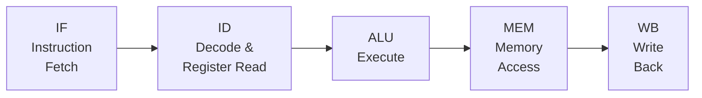
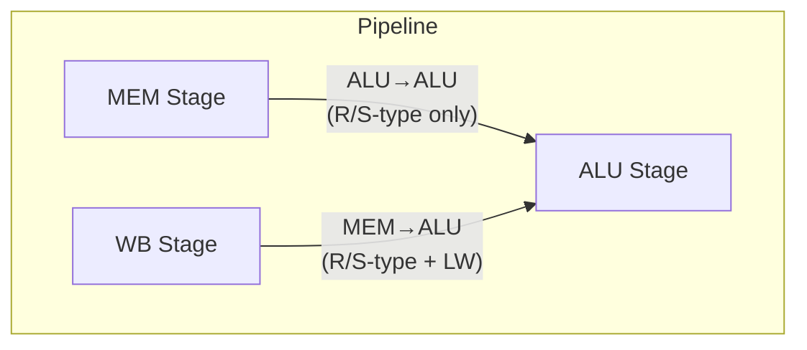

# Pipeline Architecture

ANEM16pipe implements a classic 5-stage RISC pipeline with data forwarding and hardware hazard detection.

## Pipeline Stages



### <span class="stage-badge stage-if">IF</span> Instruction Fetch

- Reads instruction from program memory at the current PC
- PC selection priority: **exception** > **jump/branch** > **sequential (PC+1)**
- External interrupts are detected here (highest priority)

### <span class="stage-badge stage-id">ID</span> Instruction Decode

- Decodes instruction fields (opcode, registers, immediates)
- Reads register file (GPR, SP, HI, LO, EPC)
- Resolves J, JAL, JR, RETI, SYSCALL (control flow decided here)
- Stall detection for data hazards

### <span class="stage-badge stage-alu">ALU</span> Execute

- Performs arithmetic/logic/shift operations
- Computes memory addresses (base + offset)
- Resolves BZ and BHLEQ branches (Z flag evaluated here)
- SP adder runs in parallel for PUSH/POP

### <span class="stage-badge stage-mem">MEM</span> Memory Access

- LW: reads data memory
- SW/PUSH: writes data memory
- MAC peripheral access

### <span class="stage-badge stage-wb">WB</span> Write Back

- Writes results to register file (GPR)
- Updates SP, HI/LO, EPC registers
- Source: ALU result, memory data, or special registers

---

## Data Forwarding

Forwarding bypasses allow back-to-back dependent instructions without stalls.

### Forwarding Paths



| Path | Source Stage | Condition | Data |
|------|------------|-----------|------|
| **ALU→ALU** | MEM (just left ALU) | `regctl = "001"` (R/S-type) | ALU output |
| **MEM→ALU** | WB (just left MEM) | `regctl = "001"` or `"100"` | ALU output or memory data |

### Forwarding Enable Conditions

- **MEM stage forwarding:** Only R-type and S-type results (`regctl = "001"`)
- **WB stage forwarding:** R/S-type (`"001"`) or LW (`"100"`)
- **Priority:** ALU→ALU (newer) wins over MEM→ALU (older) when both match

!!! info "Forwarding data mux"
    The WB forwarding data mux selects `memout` for LW (`regctl = "100"`) and `aluout` for R/S-type. This is critical — without it, LW forwarding would pass the stale ALU address instead of the loaded data.

### Write-Through Bypass

For WB→ID same-cycle overlap (distance 3), the register bank has write-through bypass muxes. When the WB stage writes a register that ID is reading on the same clock edge, the bypass provides the new value directly.

Applies to: full-word writes (`regctl` = `"001"`, `"100"`, `"110"`, `"111"`)

---

## Hazard Detection

The hazard unit (`hazunit.vhd`) detects data dependencies and inserts stalls to prevent incorrect execution.

### Stall Types

| Hazard | Trigger | Stall Cycles | Type |
|--------|---------|-------------|------|
| **LW** | Load followed by dependent | 1 | Combinational |
| **SW** | Store with in-flight source | 3 | Combinational |
| **NFW** | Non-forwarding write + dependent | 3 | Combinational |
| **JR** | JR source in ALU/MEM | 1–2 | Combinational |
| **EPC** | MTEPC in ALU/MEM + RETI/MFEPC in ID | 1–2 | Combinational |

!!! warning "Stalls must be combinational"
    All stalls are implemented as combinational concurrent signal assignments. Registered stalls are 1 delta cycle late, causing the dependent instruction to slip through to ALU before the stall takes effect.

### LW Stall (1 cycle)

```
LW $1, 0($5)       ; loads $1 at MEM stage
ADD $2, $1          ; needs $1 at ALU → stall 1 cycle, then WB forwards
```

The hazard unit detects `sela_alu` (LW destination) matching `sela_id` or `selb_id`, with `regctl_alu = "100"` (LW).

### NFW Stall (up to 3 cycles)

Non-forwarding writes (LIU, LIL, JAL, MFHI, MFLO) bypass the ALU output bus — their results aren't available for forwarding. The stall holds until the write reaches WB.

```
LIW $1, 42          ; LIU + LIL → NFW write
ADD $2, $1           ; stalls 3 cycles until $1 written at WB
```

Detected when `regctl` in ALU/MEM/WB is `"010"`, `"011"`, `"101"`, `"110"`, or `"111"`.

### SW Stall (3 cycles, auto-sustaining)

SW needs its source data before MEM stage. If the producer is still in-flight, the stall holds for up to 3 cycles. The stall is **combinational and self-sustaining** — as the producer advances through ALU → MEM → WB, the stall re-evaluates each cycle.

### id_reads_regs Deny List

Not all instructions read GPRs. The hazard unit maintains a deny list of opcodes that should not trigger read-after-write stalls:

- J, JAL, BZ variants, BHLEQ (use offsets, not registers)
- LIU, LIL (write-only)
- M1 byte loads and adds (operate on HI/LO)
- POP, SPRD (read SP, not GPR)
- SYSCALL, M4 group except MTEPC

---

## Flush Logic

When a branch or jump is taken, instructions that entered the pipeline speculatively must be flushed (replaced with NOPs).

| Source | Stage | Slots Flushed |
|--------|-------|---------------|
| J, JAL | ID | 1 (IF) |
| JR, RETI | ID | 1 (IF) |
| SYSCALL | ID | 1 (IF) |
| BZ (taken) | ALU | 2 (IF + ID) |
| BHLEQ (taken) | ALU | 2 (IF + ID) |
| External INT | IF | 1 (IF) |

The flush signal zeroes out control signals (regctl, aluctl, mem_en, mem_w) in the flushed stages, turning instructions into NOPs.

---

## Pipeline Register Map

Data flows between stages through pipeline registers (implemented as `RegANEM` instances).

### ID → ALU

| Signal | Width | Purpose |
|--------|-------|---------|
| `aluout_0` | 16 | ALU A operand |
| `regbout_0` | 16 | ALU B operand / store data |
| `sela_0` | 4 | Destination register index |
| `aluctl_0` | 3 | ALU operation type |
| `regctl_0` | 3 | Register write-back control |
| `func_0` | 5 | ALU function code |
| `mem_en_0` | 1 | Memory enable |
| `mem_w_0` | 1 | Memory write enable |
| `sp_ctl_0` | 3 | Stack operation control |
| `exc_ctl_0` | 3 | Exception control |
| `epcwr_0` | 1 | EPC write enable |

### ALU → MEM

| Signal | Width | Purpose |
|--------|-------|---------|
| `aluout_1` | 16 | ALU result |
| `regbout_1` | 16 | Store data (for SW/PUSH) |
| `sela_1` | 4 | Destination register index |
| `regctl_1` | 3 | Register write-back control |
| `mem_en_1` | 1 | Memory enable |
| `mem_w_1` | 1 | Memory write |
| `sp_ctl_1` | 3 | Stack control |
| `epcwr_1` | 1 | EPC write enable |

### MEM → WB

| Signal | Width | Purpose |
|--------|-------|---------|
| `aluout_2` | 16 | ALU result (for forwarding) |
| `memout_2` | 16 | Memory read data |
| `sela_2` | 4 | Destination register index |
| `regctl_2` | 3 | Register write-back control |
| `sp_ctl_2` | 3 | Stack control |
| `epcwr_2` | 1 | EPC write enable |

---

## Module Hierarchy

```
ANEM (top-level)
├── ifetch      — PC logic, instruction address generation
├── idecode     — Instruction decoder, register read, control signals
├── hazunit     — Hazard detection, stall generation
├── regbnk      — Register file (16 x 16-bit GPRs)
├── ALU         — Arithmetic/logic unit
├── progmem     — Program memory (ROM)
├── datamem     — Data memory (RAM)
└── MAC         — Multiply-accumulate peripheral
```
